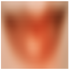

# Experimental Result
In this notes, we show the result of experiment. We separately presented the results of qualitization and quantization.
## Images from different domains
### Qualitization
* City  

* Nature  

* Painting  

* Satellite  

* X_ray  

### Quantization
| Metric | City | Nature | Painting | Satellite | X_ray |
|:------:|:--------------:|:-------------:|:----------------:|:---------------:|:---------------:|
|  PSNR  |      24.77      |     22.78      |      18.5       |      25.93       |      25.93       |
| LPIPS  |      0.12      |     0.32      |       0.15       |      0.11       |      0.11       |

## learning rate of each layers
### Qualitization
* Linear descent  

* Linear ascent  

* concave function  

* convex function  

* GT  

### Quantization
| Metric | Linear descent | Linear ascent | concave function | convex function |
|:------:|:--------------:|:-------------:|:----------------:|:---------------:|
|  PSNR  |      22.24      |     20.26      |      21.53       |      24.11       |
| LPIPS  |      0.23      |     0.32      |       0.17       |      0.07       |
## Number of layers
### Qualitization
* 1  

* 2  

* 3  

* 4  

* 5  

* GT  

### Quantization
| Metric |   1   |   2   |   3   |   4   |   5   |
|:------:|:-----:|:-----:|:-----:|:-----:|:-----:|
|  PSNR  | 19.06 | 21.25 | 22.24 | 17.37 | 15.99 |
| LPIPS  | 0.34  | 0.25  | 0.23  | 0.19  |  0.2  |
